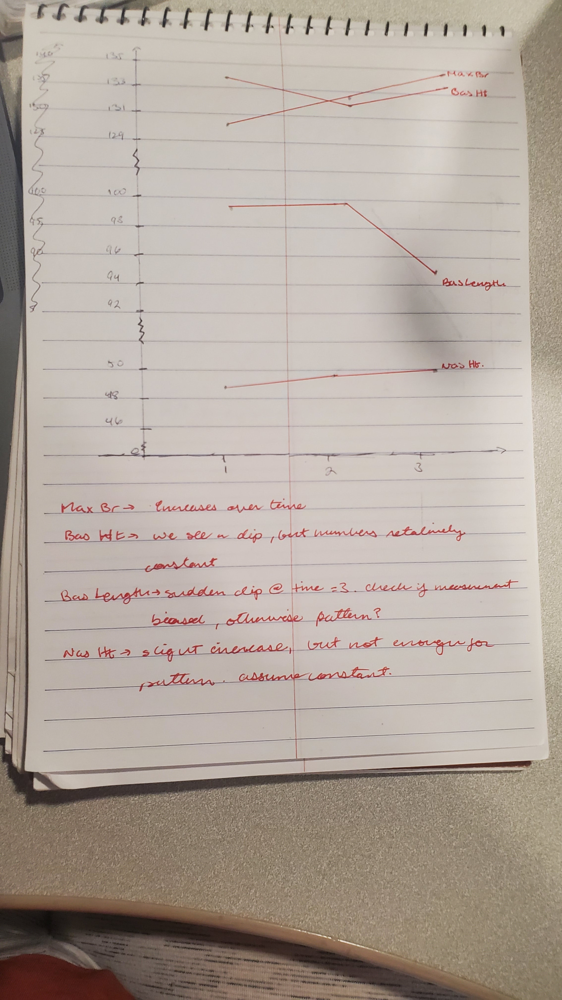
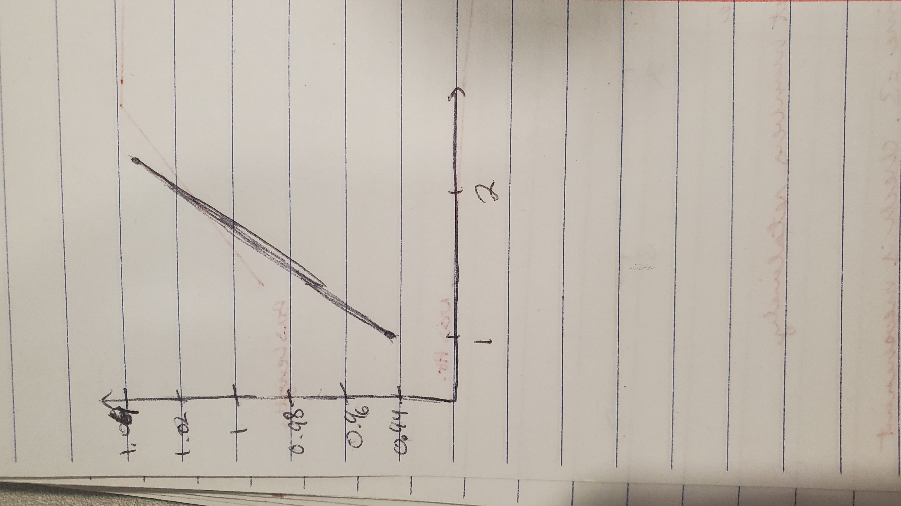

```{r setup}
# All libraries are present here:
knitr::opts_chunk$set(echo = TRUE)
library(readxl)
library(ggplot2)
library(ggExtra)
library(moments)
library(Hotelling)
library(tidyverse)
library(MASS)
library(caret)

# Reading all the spreadsheets
bankruptcy = read_xlsx("bankruptcy.xlsx")
census = read_xlsx("census.xlsx")
skull = read_xlsx("skulldata.xlsx")
wordpar = read_xlsx("wordparity.xlsx")
```

# 1)

## 1a)
Getting a sample
```{r}
# Skull data work
samplevals = data.frame()
for(i in c(1:3)) {
  setframe = skull[skull$Time == i, ]
  setvals = sample.int(length(setframe$Time), 15)
  sampleframe = setframe[setvals, ]
  samplevals = rbind(samplevals, sampleframe)
}
samplevals
```

Finding the overall mean of the sample
```{r}
overallmean = colMeans(samplevals[1:4])
overallmean
```

Level Means
```{r}
l1means = colMeans(samplevals[samplevals$Time == 1,1:4])
l2means = colMeans(samplevals[samplevals$Time == 2,1:4])
l3means = colMeans(samplevals[samplevals$Time == 3,1:4])

l1means
l2means
l3means
```
Treatment sum of squares
```{r}
treatment = (15 * (sum((overallmean - l1means)^2)))+(15 *(sum((overallmean - l2means) ^2)) )+(15 * (sum((overallmean - l3means)^2)))
treatment
```

Residual sum of squares
```{r}
resid = ((sum((samplevals[samplevals$Time == 1,1:4] - l1means)^2))) + ((sum((samplevals[samplevals$Time == 2,1:4] - l2means) ^2))) + ((sum((samplevals[samplevals$Time == 3,1:4] - l3means)^2)))
resid
```

Total Sum of squares
```{r}
total = ((sum((samplevals[samplevals$Time == 1,1:4] - overallmean)^2))) + ((sum((samplevals[samplevals$Time == 2,1:4] - overallmean) ^2))) + ((sum((samplevals[samplevals$Time == 3,1:4] - overallmean)^2)))
total
```

Manova Table:
```{r}
titles = c("Treatment, B", "Residual, W", "Total")
SS = c(treatment, resid, total)
df = c(3, 36, 42)
data.frame(titles, SS, df)
```

Wilks lambda 
```{r}
wlambda = (resid) / (resid + treatment)
wlambda
```

## 1b)



# 2)

## 2a)
```{r}
setvals2 = sample.int(length(wordpar$worddiff), 20)
samplevals2 = wordpar[setvals2, ]
samplevals2
```

```{r}
samplevals2$word = samplevals2$worddiff - samplevals2$wordsame
samplevals2$Arabic = samplevals2$Arabicsame -  samplevals2$Arabicdiff
dbardiffvsame = c(((1/20) * sum(samplevals2$word)), ((1/20)*(sum(samplevals2$Arabic))))
dbardiffvsame

varianceword = sum((samplevals2$word - dbardiffvsame[1])^2) * (1 / (20 - 1))
covwordarab = sum((samplevals2$word - dbardiffvsame[1]) * (samplevals2$Arabic - dbardiffvsame[2])) * (1 / (20 -1))
variancearab = sum((samplevals2$Arabic - dbardiffvsame[2])^2) * (1 / (20 - 1))
varianceword
covwordarab
variancearab
```

Doing the rest of the calculation by hand, we have:
(T^2) = n * (Dbar') * (inv(S)) * (Dbar) = 40.2

F-value is:
```{r}
(((19)*(2))/(18))*(qf(0.95, 2, 18))
```

By this, we know that the reactions for same vs different numbers are different, on average.

## 2b)

```{r}
samplevals2$diff = samplevals2$worddiff - samplevals2$Arabicdiff
samplevals2$same = samplevals2$wordsame - samplevals2$Arabicsame

dbarwordarab = c(((1/20) * sum(samplevals2$diff)), ((1/20)*(sum(samplevals2$same))))
dbarwordarab

variancediff = sum((samplevals2$diff - dbarwordarab[1])^2) * (1 / (20 - 1))
covdiffsame = sum((samplevals2$diff - dbarwordarab[1]) * (samplevals2$same - dbarwordarab[2])) * (1 / (20 -1))
variancesame = sum((samplevals2$same - dbarwordarab[2])^2) * (1 / (20 - 1))
variancediff
covdiffsame
variancesame
```

Doing the rest of the calculation by hand, we have:
(T^2) = n * (Dbar') * (inv(S)) * (Dbar) = 43.2

By this, we know that the reactions for written vs arabic numbers are also different, on average.

# 3)
```{r}
setvals3 = sample.int(length(census$totpop), 40)
samplevals3 = census[setvals3, ]
samplevals3
```
first the covariance matrix:
```{r}
covmatcensus = cov(samplevals3)
covmatcensus
```
and now the eigenvalues + vectors:
```{r}
decmp = eigen(covmatcensus)
decmp
```
Based on the eigenvalues present, I would want to have 3 principle components present.

```{r}
a1x = c(0,-0.955, 0.0241, -0.157, 0.0442, -0.0539)
y1 = sum(a1x^2)
y1

a2x = c(0, 0.299, 0.941, 0.0554, -0.185, -0.155)
y2 = sum(a2x^2)
y2

a3x = c(0,-0.0784, 0.0639, 0.791, 0.586, -0.144)
y3 = sum(a3x^2)
y3

```

## 3b)


## 3c)
I can't see anything in the slides pertaining to a confidence region for this question. In this case, I will be skipping it and moving ahead to other questions.

# 4)

## 4a)
Calculating by hand, I got:
L = [32.5   51.6    31.1    134   0.639]

L * L' = [1060	1680	1010	 4370	  20.8
          1680  2660  1060	 6940	  33
          1010  1600  966	   4180	  19.9
          4370	6940	4180   18100  85.9
          20.8  33    19.9   85.9   0.408]
          
          

## 4b)

## 4c)


# 5)

## 5a)
```{r}
bankruptcy
```
```{r}
avai_id = which(!is.na(bankruptcy$nita))
bankruptcy1 = bankruptcy[avai_id, ]
pop1vals = sample.int(length(bankruptcy$pop[bankruptcy1$pop == 0]), 11)
pop2vals = sample.int(length(bankruptcy$pop[bankruptcy1$pop == 1]), 15)
pop1 = bankruptcy1[bankruptcy1$pop == 0, ]
pop2 = bankruptcy1[bankruptcy1$pop == 1, ]
samplepop1 = pop1[pop1vals, ]
samplepop2 = pop2[pop2vals, ]
samplepop = rbind(samplepop1, samplepop2)
samplepop1
samplepop2
samplepop
```

```{r}
meanspop1 = colMeans(samplepop1)
meanspop2 = colMeans(samplepop2)
meanspop1
meanspop2
meanssample = colMeans(samplepop)
meanssample
```
```{r}
correctpop1vals = samplepop1 - meanssample
correctpop1vals

correctpop2vals = samplepop2 - meanssample
correctpop2vals

correctsamplevals = samplepop - meanssample
correctsamplevals
```

```{r}
cov(correctpop1vals)
cov(correctpop2vals)
cov(correctsamplevals)
```


```{r}
solve(cov(correctpop1vals))
solve(cov(correctpop2vals))
solve(cov(correctsamplevals))
```


## 5b)

```{r}
confusionMatrix(as.matrix(solve(cov(correctpop1vals))))

```


