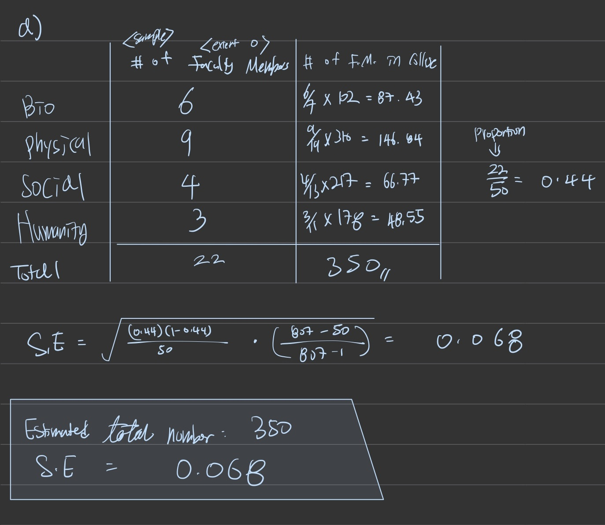
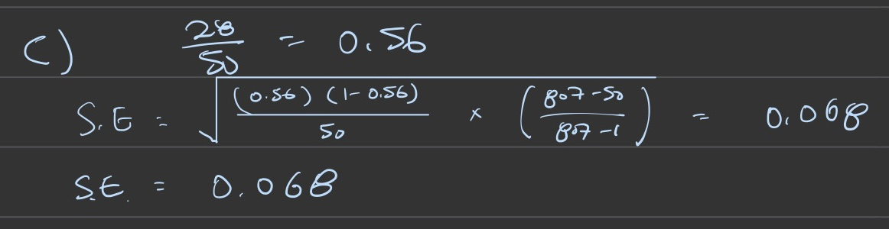
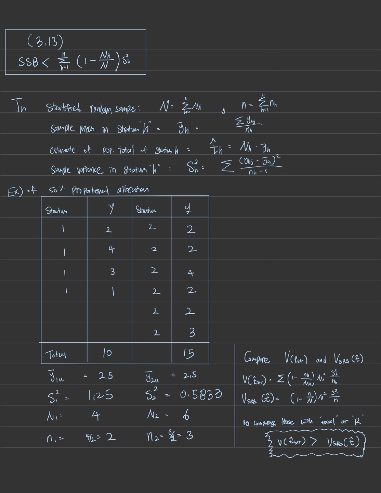

```{r setup, include=FALSE}
knitr::opts_chunk$set(echo = TRUE)
library(tidyverse)
library(combinat)
library(gtools)
library(survey) 
```

# Problem 1)
## a)
  _Solution:_ 
  Stratum 1:

```{r}
# Stratum 1
samplest <- c()
sum_countt <- NULL
sumvalt <- NULL

pop1 = c(1, 2, 4, 8)
samples1 <- c()
sum_count1 <- NULL
sumval1 <- NULL
n1 <- 2
N1 <- 4

for(i in c(1:4)) {
  for (j in c(1:4)) {
    if(i == j) {
      next
    }
    sample <- c( pop1[i], pop1[j])
    samples1 <- rbind(samples1, sample)
    samplest <- rbind(samplest, sample)
    sval1 = pop1[i] + pop1[j]
    sval = (sval1*n1)/N1
    
    if (sval %in% sumval1){
      index = match(sval, sumval1)
      sum_count1[index] = sum_count1[index] + 1
      index = match(sval, sumvalt)
      sum_countt[index] = sum_countt[index] + 1
    }
    else {
      sumval1 = c(sumval1, sval)
      sum_count1 = c(sum_count1, 1)
      sumvalt = c(sumvalt, sval)
      sum_countt = c(sum_countt, 1)
    }
  }
}
samples1
```

  Stratum 2:
```{r}
# Stratum 2
pop2 = c(4, 7, 7, 7)
samples2 <- c()
sum_count2 <- NULL
sumval2 <- NULL
n2 <- 2
N2 <- 4

for(i in c(1:4)) {
  for (j in c(1:4)) {
    if(i == j) {
      next
    }
    sample <- c(pop2[i], pop2[j])
    samples2 <- rbind(samples2, sample)
    samplest <- rbind(samplest, sample)
    sval1 = pop2[i] + pop2[j]
    sval = (sval1*n2)/N2
    
    if (sval %in% sumval2){
      index = match(sval, sumval2)
      sum_count2[index] = sum_count2[index] + 1
      index = match(sval, sumvalt)
      sum_countt[index] = sum_countt[index] + 1
    }
    else {
      sumval2 = c(sumval2, sval)
      sum_count2 = c(sum_count2, 1)
      sumvalt = c(sumvalt, sval)
      sum_countt = c(sum_countt, 1)
    }
  }
}
samples2
```


## b)
  _Solution:_

```{r}
samplest <- c()
sum_countt <- NULL
sumvalt <- NULL
nt <- 4
Nt <- 8
for(i in c(1:length(samples1[,1]))){
  for(j in c(1:length(samples2[,1]))){
    # creating the sample value and total
    sample <- c(samples1[i,1:2], samples2[j,1:2])
    sval1 = samples1[i,1] + samples1[i,2] + samples2[j,1] + samples2[j,2]
    sval = (sval1/nt) * Nt
    samplest <- rbind(samplest, sample)
    
    #checking if the total already exists, add 1 if it does, create new ti if not
    if (sval %in% sumvalt){
      index = match(sval, sumvalt)
      sum_countt[index] = sum_countt[index] + 1
      
    }
    else {
      sumvalt = c(sumvalt, sval)
      sum_countt = c(sum_countt, 1)
    }
    
  }
}
#posting only the unique samples for ease of reading tbh. Total possible samples = 144.
unique(samplest)
stotal = sum(sum_countt)
probst = sum_countt/stotal
data.frame(sumvalt, sum_countt, probst)
```

## c)
  _Solution: _
  
```{r}
meanval = sum(sumvalt * probst)
meanval
varval = (1/(sum(sum_countt) - 1)) * sum((sumvalt - meanval) ^ 2)
varval
```


# Problem 2)

## a)
```{r}
student = c(1,2,3,4,5,6)
score = c(66,59,70,83,82,71)
dat_p2 = data.frame(student, score)
dat_p2

N = 6
summary(dat_p2)
n <- length(dat_p2$score)
var.dat_p2 = var(dat_p2$score) * (n-1)/n
mean(dat_p2$score)
var.dat_p2
```

## b)
```{r}
samples <- c()
n <- 4
N <- 6

for (i in 1:6){
  for (j in 1:6){
    for (k in 1:6){
      for (l in 1:6){
       
        sample <- c( score[i], score[j],score[k],score[l])
        samples <- rbind(samples, sample)
      }
    }
  }
}
samples <- data.frame(samples)


#num_rows = nrow(srs(dat_p2$score, n))

#srs_dat = srs(dat_p2$score, n)
```
  _Solution: _
  The possible SRS’s of size 4 is 15.

## c)
  _Solution: _
  Variance(y-bar) is 5.9837963.

## d)
```{r}
H <- 2            #number of strata
N_h <- c(3,3)   #strata sizes
N <- sum(N_h)     #overall population size
n_h <- c(2,2)   #sample size in each strata
n <- sum(n_h)     #overall sample size

#number of stratified sampling
dim(combn(3,2))[2]*dim(combn(3,2))[2]
```

## e)
```{r}
student <- c(1,2,3,4,5,6)
score <- c(66,59,70,83,82,71)
data <- data.frame(student, score)

stratum_1 <- t(combn(c(1,2,3),2))
stratum_2 <- t(combn(c(4,5,6),2))

srs <- data.frame()
for (i in 1:3){
  for (j in 1:3){
    temp <- c(stratum_1[i,],stratum_2[j,])
    srs <- rbind(srs,temp)
  }
}

srs_y <- data.frame()
for (i in 1:nrow(srs)) {
  a <- c()  
  for (j in srs[i,]) {
    a <- append(a, data[data['student']==j][2])
  }
  srs_y<- rbind(srs_y, a)
}

srs_final <- cbind(srs,srs_y)
srs_final
```

## f)
```{r}
y_strmean <- rowMeans(srs_final[,5:8])

srs1_mean <- mean(score[1:3])
S1 <- sum((score[1:3] - srs1_mean)^2) / 2
S1
srs2_mean <- mean(score[4:6])
S2 <- sum((score[4:6] - srs2_mean)^2) / 2
S2
var_y <- ((1-(2/3)) * (3/6)^2 * S1/2) + ((1-(2/3)) * (3/6)^2 * S2/2)
var_y
```

# Problem 3)

## a)
_Question: _ 
  _Solution: _
  Use an allocation based on proportion of units. Sample 350 house, 450 apartment, and 100 condominium units.

## b)
  _Solution: _
  Run a quota style sample to get a proportional allocation based on the percentages. 
  Sample in this way:
  158 house dwellers who practice conservation
  192 house dwellers who do not practice conservation
  113 apartment dwellers who practice conservation
  337 apartment dwellers who do not practice conservation
  3 condominuim dwellers who practice conservation
  97 condimonium dwellers who do not practice conservation
  Doing it this way will result in having a smaller Vprop than a VSRS, and a Vprop from the previous allocation. This means the fraction will be smaller in all cases, and therefore there will be a smaller variance in the data, making it more precise (not sure about accurate :))


# Problem 4)
```{r}

```

## b)
  _Solution: _\
  We can find that the S.E. has got lower with Stratified method than using SRS method.

## c)
```{r}

```


# Problem 5)
`  _Solution: _
  Put 75 squares and 25 circles for a total of 100 objects when proportionally allocation strata.

```{r}
stratum1 <- c(1,2,3,4)
area <- c(222.81,49.61,50.25,197.81)
nh <- c(4,6,3,5)
yh1 <- c(0.44, 1.17, 3.92, 1.8)
Sh1 <- c(0.068, 0.042, 2.146, 0.794)
cla <- data.frame(stratum1, area, nh, yh1, Sh1)
cla['Nh'] <- cla['area'] * 25.6
cla['t'] <- cla['Nh'] * cla['yh1']
cla['v'] <- (1 - (cla['nh']/cla['Nh'])) * (cla['Nh'])^2 * (cla['Sh1']/cla['nh'])
sum(cla['t'])
sqrt(sum(cla['v']))
```


# Problem 6)
```{r}

```


# Problem 7)

## a)
```{r}
p1 = 0.1
p2 = 0.03
n1.n = 0.4
n2.n = 1 - n1.n
S21 = n1.n * p1 * (1 - p1)
S22 = n2.n * p2 * (1 - p2)
nh1 = (n1.n * (sqrt(S21))) * 2000
nh2 = (n2.n * (sqrt(S22))) * 2000
nh1
nh2
```

## b)
variance under optimal < variance under proportional < variance under SRS, mainly as we are changing the allocations to better suit the population.

## c)
Tbh, no idea how to do this...


